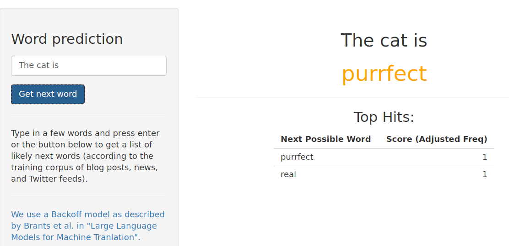

Coursera's Data Science Capstone Project 
========================================================
author: Antonio Rueda-Toicen
date: October 1st, 2016
autosize: true

Word Prediction Using N-gram Backoff Model
========================================================
The Shiny app [here]() predicts the next word in a sentence using an N-gram backoff technique formulated by Brants et al. (Google guys) in ["Large Language Models for Translation."](http://www.aclweb.org/anthology/D07-1090.pdf) 
N-gram histograms represent counts of consecutive words that appear a corpus of text. They serve as statistical models of likely uses for words. 
* 4-grams aka tetragrams = 4 words e.g., "you are my daughter"
* 3-grams aka trigrams = 3 words e.g., "you are my"
* 2-grams aka bigrams = 2 words e.g., "you are"

What the app does
========================================================
From a training corpus of blog posts, news articles, and Twitter feeds, the app: 
* Predicts the next word in a typed phrase
* Shows up to 5 suggestions for text completion

Simple Usage
========================================================
Try the app [here](). Results are fast because we use a SQLite database that's very good at doing quick queries.

How the app processes input
====================================
1. Input text is normalized:
  + converted to lowercase, stripped of punctuation and numbers
  
2. We check if a known (in the training corpus) 4-gram appears in the normalized input and use it to suggest a word, if not:
  + check if a 3-gram has been seen
  + check if a 2-gram has been seen
  + plead ignorance
  
Future work
=============================
* We use only a subset of the Swiftkey dataset of blogs, news, and tweets. 
* With a larger training corpus, the completion can become much more usable, this demo app runs a free Shinyapps.io account given by Coursera and uses less than 100 Mb. 
